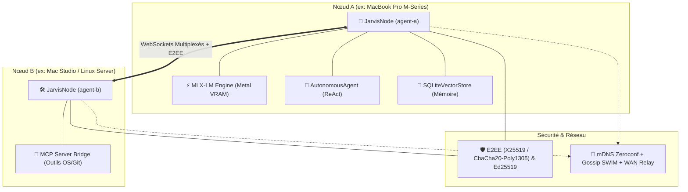

# 🌐 JarvisMesh — Protocole d'Agents IA Locaux, Souverain & Distribué

[🇬🇧 Read in English](README.md) | [🇫🇷 Lire en Français](README.fr.md)

[](https://www.python.org/downloads/)
[](LICENSE)
[](https://github.com/ml-explore/mlx)
[](#-sécurité-authentification-asymétrique--chiffrement-e2ee)
[](#-passerelle-mcp-bi-directionnelle)
[](#-architecture--principes-fondamentaux)

**JarvisMesh** est un écosystème pair-à-pair (P2P), souverain et extensible pour agents d'intelligence artificielle distribués.

Au lieu que chaque agent dépende d'une API cloud centralisée et propriétaire, les agents tournant sur vos machines (Mac Apple Silicon, serveurs Linux, stations de travail locales ou distantes) :
1. **Se découvrent automatiquement** via mDNS/Zeroconf, protocole Gossip (SWIM) ou relais WAN (Tailscale/VPN).
2. **S'échangent et se délèguent des tâches** via des WebSockets persistants, multiplexés et chiffrés de bout en bout (E2EE X25519/ChaCha20).
3. **Exploitent l'inférence locale** accélérée sur GPU Apple Silicon via MLX-LM avec streaming token-par-token.
4. **Collaborent en agents ReAct autonomes** avec auto-réparation (*Self-Healing*) et mémoire vectorielle persistante SQLite.
5. **Intègrent n'importe quel outil externe** via le standard **Model Context Protocol (MCP)**.

---

## 📑 Table des Matières
- [Architecture & Principes Fondamentaux](#-architecture--principes-fondamentaux)
- [Installation Rapide](#-installation-rapide)
- [Fonctionnalités Clés](#-fonctionnalités-clés)
  - [1. Inférence MLX Apple Silicon & Streaming Metal](#1--inférence-mlx-apple-silicon--streaming-metal)
  - [2. Agents Autonomes ReAct & Self-Healing](#2--agents-autonomes-react--self-healing)
  - [3. Mémoire Épisodique & SQLite Vectoriel](#3--mémoire-épisodique--sqlite-vectoriel)
  - [4. Sécurité : Ed25519 & Chiffrement E2EE](#4--sécurité--ed25519--chiffrement-e2ee)
  - [5. Passerelle MCP Bi-Directionnelle](#5--passerelle-mcp-bi-directionnelle)
  - [6. Orchestrateur de Workflows DAG](#6--orchestrateur-de-workflows-dag)
  - [7. Démon Système & Protocole Gossip SWIM](#7--démon-système--protocole-gossip-swim)
  - [8. Dashboard Web & Télémétrie en Direct](#8--dashboard-web--télémétrie-en-direct)
- [Interface en Ligne de Commande (CLI)](#-interface-en-ligne-de-commande-cli)
- [Arborescence du Projet](#-arborescence-du-projet)
- [Exécution des Tests](#-exécution-des-tests)
- [Licence & Auteur](#-licence--auteur)

---

## 🏛️ Architecture & Principes Fondamentaux



---

## 🚀 Installation Rapide

```bash
# Cloner le dépôt
git clone https://github.com/samajesteduroyaume/jarvismesh.git
cd jarvismesh

# Créer un environnement virtuel et installer avec MLX
python3 -m venv .venv
source .venv/bin/activate
pip install -e ".[dev,mlx,validation]"
```

---

## ✨ Fonctionnalités Clés

### 1. ⚡ Inférence MLX Apple Silicon & Streaming Metal
JarvisMesh intègre un moteur natif MLX-LM optimisé pour la mémoire unifiée Apple Silicon.
- Inférence synchrone (`llm`) et streaming continu token-par-token (`llm-stream`).
- Suivi en temps réel de la VRAM Metal (`metal_active_mb`, `peak_mb`, `cache_mb`).

### 2. 🤖 Agents Autonomes ReAct & Self-Healing
Boucle de raisonnement autonome multi-étapes (*Thought ➔ Action ➔ Observation ➔ Final Answer*) :
- Découverte automatique des compétences disponibles sur tous les pairs du réseau.
- Auto-réparation : si un outil échoue ou qu'un argument est invalide, l'agent réanalyse l'erreur et adapte sa stratégie sans planter.

```bash
jarvismesh agent "Audit la mémoire système et résume l'état du cluster"
```

### 3. 🧠 Mémoire Épisodique & SQLite Vectoriel
Base de données vectorielle SQLite persistante (`~/.jarvismesh/memory.db`) :
- Embeddings denses multi-échelles (sous-mots et n-grammes) avec similarité cosinus.
- Suivi des conversations (`ConversationMemory`) et compétences mesh associées (`memory_store`, `memory_recall`, `memory_search`).

### 4. 🛡️ Sécurité : Ed25519 & Chiffrement E2EE
- **Signatures asymétriques Ed25519** avec `TrustStore` et horodatage anti-rejeu.
- **Chiffrement de bout en bout E2EE** (Diffie-Hellman **X25519** + **ChaCha20-Poly1305**) garantissant la confidentialité sur réseaux publics et relais WAN.

### 5. 🔌 Passerelle MCP Bi-Directionnelle
- Consomme des serveurs d'outils **Model Context Protocol (MCP)** stdio et les expose comme compétences sur tout le réseau.
- Expose JarvisMesh comme serveur MCP pour Claude Desktop, Cursor ou Windsurf.

### 6. 🔄 Orchestrateur de Workflows DAG
Moteur déclaratif de pipelines séquentiels et parallèles avec résolution de variables :
```json
{
  "name": "rag-pipeline",
  "steps": [
    { "name": "retrieve", "skill": "memory_search", "payload": { "query": "Metal GPU" } },
    { "name": "synthesize", "skill": "llm", "payload": { "prompt": "Résume: {steps.retrieve.result}" }, "depends_on": ["retrieve"] }
  ]
}
```

### 7. ⚙️ Démon Système & Protocole Gossip SWIM
- Démon d'arrière-plan avec gestion native **macOS `launchd`** (`~/Library/LaunchAgents/`) et **Linux `systemd`**.
- Protocole épidémique **SWIM** pour synchroniser l'appartenance et la santé sur des clusters de 100+ nœuds.

### 8. 📊 Dashboard Web & Télémétrie en Direct
Interface interactive en temps réel (SSE / WebSockets) :
- Visualisation de la topologie réseau et santé des nœuds.
- Studio d'Inférence IA avec compteur de débit (tokens/seconde) et jauges VRAM Metal.

---

## 💻 Interface en Ligne de Commande (CLI)

```bash
# 1. Générer une identité Ed25519
jarvismesh keygen --out node_id.key

# 2. Démarrer un nœud avec modèle MLX et mémoire SQLite
jarvismesh start --name mac-m3 --port 8765 --model mlx-community/Qwen2.5-Coder-7B-Instruct-4bit

# 3. Lancer un agent autonome ReAct
jarvismesh agent "Recherche les documents sur le chiffrement et résume-les"

# 4. Gérer le service démon système
jarvismesh service install --name mac-m3 --port 8765
jarvismesh service start
jarvismesh service status

# 5. Démarrer le Dashboard Web
jarvismesh dashboard --port 8080
```

---

## 📂 Arborescence du Projet

```text
jarvismesh/
├── jarvismesh/               # Code source du package
│   ├── __init__.py           # Exports de l'API publique
│   ├── node.py               # Nœud P2P, multiplexage, découverte, routage adaptatif
│   ├── protocol.py           # Messages JSON, signatures HMAC & Ed25519
│   ├── crypto.py             # Gestion des clés Ed25519 & TrustStore
│   ├── e2ee.py               # Chiffrement de bout en bout X25519 & ChaCha20-Poly1305
│   ├── mlx_engine.py         # Moteur MLX-LM dédié, streaming Metal, métriques VRAM
│   ├── agent.py              # Agent Autonome ReAct & Function Calling Distribué
│   ├── memory.py             # Base vectorielle SQLite persistante & mémoire épisodique
│   ├── orchestrator.py       # Moteur de workflows multi-agents DAG
│   ├── mcp_bridge.py         # Passerelle bi-directionnelle MCP
│   ├── rag.py                # Base vectorielle locale TF-IDF & compétences RAG
│   ├── wan.py                # Relais WAN & synchronisation distante
│   ├── daemon.py             # Service démon macOS launchd / Linux systemd
│   ├── gossip.py             # Protocole Gossip SWIM pour cluster haute échelle
│   ├── cli.py                # Interface CLI complète
│   └── dashboard/            # Serveur HTTP/SSE & Dashboard Web interactif
├── tests/                    # 14 suites de tests automatisées (100% pass)
├── examples/                 # Scripts et cas d'usage de production
├── workflows/                # Définitions de pipelines DAG en JSON
├── pyproject.toml            # Configuration et packaging
├── LICENSE                   # Licence MIT (Selim Marouani)
└── README.md                 # Documentation
```

---

## 🧪 Exécution des Tests

L'intégralité des 14 suites de tests est exécutable via `pytest` :

```bash
.venv/bin/python -m pytest tests/
```

---

## 📜 Licence & Auteur

Créé et maintenu par **Selim Marouani**.  
Distribué sous licence **MIT**. Voir le fichier [LICENSE](LICENSE) pour plus de détails.
