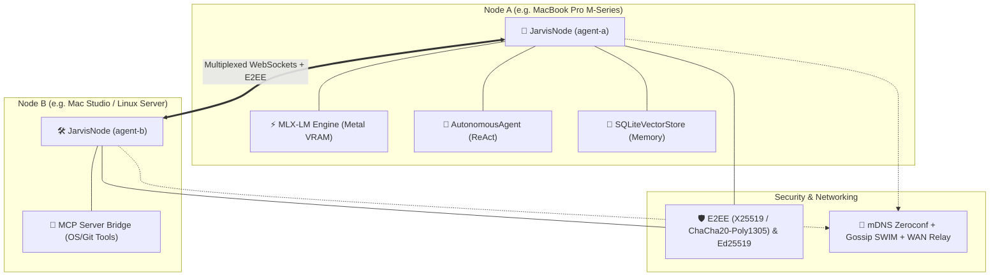

# 🌐 JarvisMesh — Sovereign & Distributed Local AI Agent Mesh

[🇬🇧 Read in English](README.md) | [🇫🇷 Lire en Français](README.fr.md)

[](https://www.python.org/downloads/)
[](LICENSE)
[](https://github.com/ml-explore/mlx)
[](#-security-asymmetric-auth--e2ee-encryption)
[](#-bi-directional-mcp-gateway)
[](#-architecture--core-principles)

**JarvisMesh** is a sovereign, decentralized peer-to-peer (P2P) mesh and operating layer for distributed AI agents.

Instead of relying on centralized, proprietary cloud APIs, agents running across your devices (Apple Silicon Macs, Linux servers, local workstations, or edge nodes):
1. **Auto-discover each other** via mDNS/Zeroconf, Gossip protocol (SWIM), or WAN relay servers (Tailscale/VPN).
2. **Exchange and delegate tasks** over persistent, multiplexed, end-to-end encrypted WebSockets (E2EE X25519/ChaCha20).
3. **Execute local LLM inference** accelerated on Apple Silicon Metal GPU via MLX-LM with continuous token-by-token streaming.
4. **Collaborate as autonomous ReAct agents** with dynamic tool calling, self-healing error recovery, and persistent SQLite vector memory.
5. **Ingest and expose tools** via the open **Model Context Protocol (MCP)** standard.

---

## 📑 Table of Contents
- [Architecture & Core Principles](#-architecture--core-principles)
- [Quickstart](#-quickstart)
- [Key Features](#-key-features)
  - [1. Apple Silicon MLX GPU Engine & Metal Streaming](#1--apple-silicon-mlx-gpu-engine--metal-streaming)
  - [2. Autonomous ReAct Agents & Self-Healing](#2--autonomous-react-agents--self-healing)
  - [3. Episodic Memory & Persistent SQLite Vector Store](#3--episodic-memory--persistent-sqlite-vector-store)
  - [4. Security: Ed25519 & E2EE Encryption](#4--security-ed25519--e2ee-encryption)
  - [5. Bi-Directional MCP Gateway](#5--bi-directional-mcp-gateway)
  - [6. Multi-Agent DAG Workflow Orchestrator](#6--multi-agent-dag-workflow-orchestrator)
  - [7. Background System Daemon & SWIM Gossip Protocol](#7--background-system-daemon--swim-gossip-protocol)
  - [8. Real-Time Web Dashboard & Telemetry](#8--real-time-web-dashboard--telemetry)
- [Command-Line Interface (CLI)](#-command-line-interface-cli)
- [Project Directory Structure](#-project-directory-structure)
- [Running Automated Tests](#-running-automated-tests)
- [License & Author](#-license--author)

---

## 🏛️ Architecture & Core Principles



---

## 🚀 Quickstart

```bash
# Clone repository
git clone https://github.com/samajesteduroyaume/jarvismesh.git
cd jarvismesh

# Create virtual environment and install with MLX support
python3 -m venv .venv
source .venv/bin/activate
pip install -e ".[dev,mlx,validation]"
```

---

## ✨ Key Features

### 1. ⚡ Apple Silicon MLX GPU Engine & Metal Streaming
JarvisMesh natively embeds MLX-LM optimized for unified Apple Silicon memory:
- Synchronous inference (`llm`) and real-time token-by-token streaming (`llm-stream`).
- Active Metal GPU memory tracking (`metal_active_mb`, `peak_mb`, `cache_mb`).

### 2. 🤖 Autonomous ReAct Agents & Self-Healing
Autonomous multi-step reasoning loop (*Thought ➔ Action ➔ Observation ➔ Final Answer*):
- Automatically discovers available tools and skills across all mesh peers.
- **Self-Healing**: If a skill call fails or parameters are invalid, the agent inspects the error observation and autonomously retries with an updated strategy.

```bash
jarvismesh agent "Inspect system memory and summarize cluster state"
```

### 3. 🧠 Episodic Memory & Persistent SQLite Vector Store
Persistent SQLite database (`~/.jarvismesh/memory.db`):
- Dense multi-scale subword and character n-gram embeddings with cosine similarity.
- Dialogue memory tracking (`ConversationMemory`) and associated skills (`memory_store`, `memory_recall`, `memory_search`).

### 4. 🛡️ Security: Ed25519 & E2EE Encryption
- **Asymmetric Ed25519 signatures** with `TrustStore` validation and anti-replay timestamps.
- **End-to-End Encryption (E2EE)** via **X25519** ECDH key exchange and **ChaCha20-Poly1305** authenticated cipher, guaranteeing privacy even across public WAN relays.

### 5. 🔌 Bi-Directional MCP Gateway
- Ingests external **Model Context Protocol (MCP)** servers over stdio and exposes tools as distributed mesh skills.
- Exposes JarvisMesh as an MCP tool server for Claude Desktop, Cursor, or Windsurf.

### 6. 🔄 Multi-Agent DAG Workflow Orchestrator
Declarative execution engine supporting sequential and parallel branching with template substitution:
```json
{
  "name": "rag-pipeline",
  "steps": [
    { "name": "retrieve", "skill": "memory_search", "payload": { "query": "Metal GPU" } },
    { "name": "synthesize", "skill": "llm", "payload": { "prompt": "Summarize: {steps.retrieve.result}" }, "depends_on": ["retrieve"] }
  ]
}
```

### 7. ⚙️ Background System Daemon & SWIM Gossip Protocol
- Background system daemon management with native **macOS `launchd`** (`~/Library/LaunchAgents/`) and **Linux `systemd`**.
- Epidemic **SWIM Gossip protocol** for scalable membership tracking and failure detection across 100+ nodes.

### 8. 📊 Real-Time Web Dashboard & Telemetry
Interactive web interface over SSE / WebSockets:
- Real-time node topology, health, and latency visualization.
- AI Inference Studio with token throughput (tokens/sec) and GPU Metal VRAM gauges.

---

## 💻 Command-Line Interface (CLI)

```bash
# 1. Generate an Ed25519 identity key
jarvismesh keygen --out node_id.key

# 2. Start a node with MLX model and SQLite memory
jarvismesh start --name mac-m3 --port 8765 --model mlx-community/Qwen2.5-Coder-7B-Instruct-4bit

# 3. Launch an autonomous ReAct agent
jarvismesh agent "Search security documentation and summarize findings"

# 4. Manage background system service
jarvismesh service install --name mac-m3 --port 8765
jarvismesh service start
jarvismesh service status

# 5. Start the Web Dashboard
jarvismesh dashboard --port 8080
```

---

## 📂 Project Directory Structure

```text
jarvismesh/
├── jarvismesh/               # Core package source code
│   ├── __init__.py           # Public API exports
│   ├── node.py               # P2P Node, multiplexing, discovery, adaptive routing
│   ├── protocol.py           # JSON schemas, HMAC & Ed25519 signatures
│   ├── crypto.py             # Ed25519 identities & TrustStore
│   ├── e2ee.py               # End-to-end encryption X25519 & ChaCha20-Poly1305
│   ├── mlx_engine.py         # Dedicated MLX-LM engine, Metal streaming, VRAM metrics
│   ├── models.py             # Multi-Model Manager with LRU Metal GPU cache
│   ├── agent.py              # Autonomous ReAct Agent & Distributed Function Calling
│   ├── memory.py             # Persistent SQLite vector store & episodic memory
│   ├── reranker.py           # Semantic Cross-Encoder Reranker
│   ├── graph_memory.py       # Knowledge Graph Store (GraphRAG)
│   ├── offline_queue.py      # Store & Forward persistent task queue
│   ├── consensus.py          # Multi-Agent Consensus, Voting & Adversarial Debate
│   ├── rbac.py               # Role-Based Access Control (RBAC) security policy
│   ├── orchestrator.py       # DAG multi-agent workflow engine
│   ├── mcp_bridge.py         # Bi-directional MCP gateway
│   ├── rag.py                # Local TF-IDF vector store & RAG skills
│   ├── wan.py                # WAN relay & remote node synchronization
│   ├── daemon.py             # System daemon manager (macOS launchd / Linux systemd)
│   ├── gossip.py             # SWIM Gossip protocol for large-scale clusters
│   ├── cli.py                # Comprehensive CLI interface
│   └── dashboard/            # HTTP/SSE server & dark glassmorphic Web UI
├── tests/                    # 19 automated test suites (100% pytest pass rate, 34 tests)
├── examples/                 # Production scripts and real-world workflows
├── workflows/                # Declarative JSON workflow definitions
├── pyproject.toml            # Project packaging & dependencies
├── LICENSE                   # MIT License (Selim Marouani)
├── README.fr.md              # French documentation
└── README.md                 # English documentation
```

---

## 🧪 Running Automated Tests

Run all 19 test suites in a single command via `pytest` (34 tests passed):

```bash
.venv/bin/python -m pytest tests/
```

Or execute individual test suites:
```bash
.venv/bin/python tests/test_agent_react.py
.venv/bin/python tests/test_e2ee.py
.venv/bin/python tests/test_memory_sqlite.py
.venv/bin/python tests/test_gossip_daemon.py
```

---

## 📜 License & Author

Created and maintained by **Selim Marouani**.  
Distributed under the **MIT License**. See [LICENSE](LICENSE) for details.
